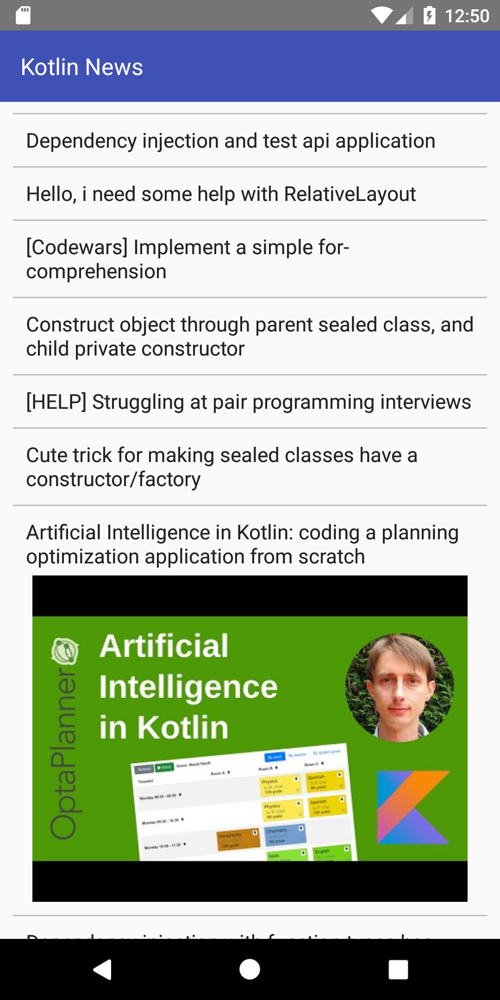
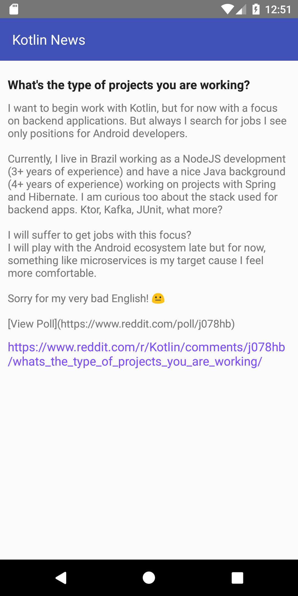
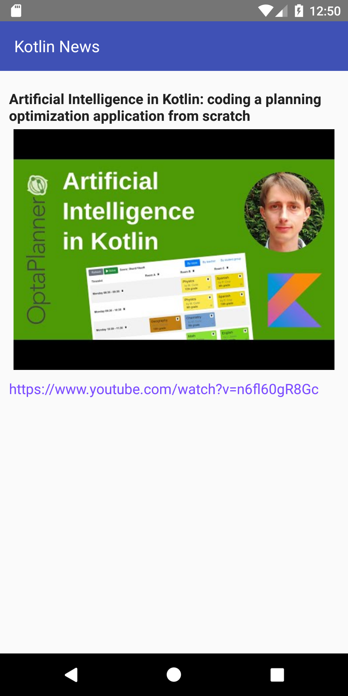

# Reddit Kotlin News Aggregator Android App

Android app developed in Kotlin as a part of an Interview Challenge. This app connects with Reddit JSON API to get list of Kotlin articles.
https://www.reddit.com/r/kotlin/.json

First Screen displays list of Kotlin articles. Selecting any article opens the detailed view. 

The app has been developed in Kotlin using coroutines, okHttp, retrofit, Android Architecture Components and MVVM architecture.

  <b>ListView Screenshot</b>
   
  
   

  <b>Detail View Screenshot</b>
   
  
   

  <b>Detail View Screenshot with Thumbnail</b>
   
  

# Features:

1. Display list of articles in Kotlin subreddit.
2. Implement infinite scrolling by using the paging library. The library loads 30 articles at a time and loads more as the user scrolls down. 
3. Swipe to refresh: When the user swipes down on the list view, it will fetch new data from the backend server and update the view.
4. Display article details when user clicks on any article.
5. URL is displayed in the detailed view if it is part of the JSON object. 
6. Clicking on the URL opens browser with the URL. Back press takes the user back to the app. 

# Architecture and Folder Organization:
For this coding challenge, I used MVVM architecture and live data to update UI whenever data is changed. I prefer MVVM architecture over other architecture patterns such as MVC, MVI or MVP because it provides a clear separation between views, repositories and models. ViewModel updates the view based on changes in live data. Another reason for selecting MVVM architecture is each component is only resposible for a particular task without having to worry about the other components. 

Package structure that I used for this app is described below: 
1. apis: This package includes Retrofit Builder to make and establish the network connection. There is another file which holds the API interface to make the GET API call. Lastly, there is sealed class to format the result of the API call for the UI to handle the API response. 
2. model: This package includes all the serialized data classes based on the API response.
3. repository: This package includes  data source files. 
4. ui: This package includes sub packages for activities, fragments, viewmodels and adapters to hold these files respectively. In addition to this it also holds UI files which can be used throughout the app. For example: SimpleDividerItemDecoration.
5. Lastly, there is a file called Constants in the app package. This file contains all the constants that the app will use for proper functioning. Note: This does not include any string constants. Strings should always be in strings.xml which makes it easier for localizations.

